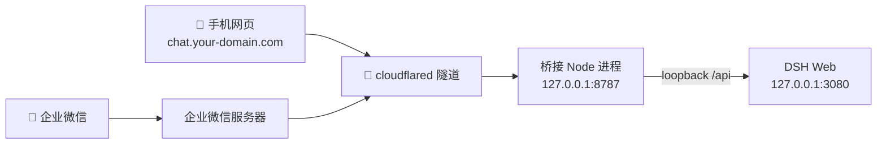

# DSH 手机远程控制台（dsh-roam）

把本机 **DeepSeek Harness (DSH)** 装进口袋：一个 DeepSeek 风格的**响应式网页**（会话、聊天、流式回复、提问/审批、余额、模型切换、文件上传、主题），外加一个**可选的企业微信消息通道**。

> 底层全部自己实现，桥接走 DSH 的 `/api`（loopback），网页走桥接自己的 HTTP 服务，**不依赖 DSH 插件槽位、不依赖 Cloudflare Access**，所以不随 DSH 版本升级而崩。

---

## English 🇬🇧

A self-hosted **mobile control console for DeepSeek Harness (DSH)**: a DeepSeek-styled responsive web UI (sessions, streaming chat, approve/reject, balance, model switching, cache/preload, file upload, themes) plus an **optional WeCom (企业微信) channel** — all built from scratch over DSH's loopback `/api`, exposed to the public internet via a **Cloudflare tunnel**.

- **Zero npm dependencies** backend (pure Node ESM) + single-file vanilla frontend (no build step)
- **No DSH plugin slots, no Cloudflare Access** — survives DSH upgrades
- **Cross-platform** one-click deploy + auto-start (Windows `.ps1` / macOS `.sh`)

**Stack**: Node.js · WebSocket · SSE · 企业微信 API (AES-256-CBC) · cloudflared

---

## 🧱 架构



- **桥接**（常驻 Node 进程）：一面驱动 DSH（会话、流式、提问/审批、模型），一面服务手机网页 + 转发企业微信回调。
- **隧道**（cloudflared 命名隧道）：把本机服务暴露到公网，**本机不需要公网 IP / 端口映射**，IP 怎么变都不影响。

---

## ✨ 功能

### 📱 响应式网页（`https://chat.your-domain.com`，密码默认 `你的密码`；手机抽屉侧栏 / 桌面居中限宽）
- 会话**列表 + 切换 + 新建 + 打断**（打断**按会话独立**）
- **聊天 + 流式回复**（短回复整段升起 / 长回复转流式 + 断线自动恢复）
- **提问选项按钮**、**审批允许/拒绝按钮**（点选即回传 agent）
- **文件上传**：📎 支持 md/txt 文本 + 图片
- 顶栏**余额**（¥ 仅人民币，点击刷新）+ **本次对话消费**（余额左侧，整段对话累计）
- **模型管理**：输入框上方状态条，点开**左右两栏**（左=模型、右=思考强度）
- **三段式主题**（深色/浅色/自动随系统）、**手动刷新**（侧栏 🔄）、每条消息复制按钮
- **缓存与预载**：会话缓存秒切 + localStorage 持久化（刷新秒开）、后台预载开关、未读徽章、清理缓存
- 官方 logo（鲸鱼 + deepseek + HARNESS，侧栏顶部）

### 💬 可选扩展：企业微信消息通道
- （附赠）微信里发消息 → 驱动本机 DSH → 回复流式推回；纯文字、无 UI，适合快速下指令。
- 命令：`列表` `切换 N` `新建` `退出` `记录` `打断` `取消` `帮助`（也支持 `/list` 等英文）
- 支持提问/审批（文本式）；核心亮点是逆向实现了企业微信回调的 **AES-256-CBC 加解密（32 字节块 PKCS#7 非标填充）**。

---

## 📁 目录结构

```
dsh-roam/
├── .env / .env.example        # 配置（密码、DSH、企业微信）
├── package.json
├── README.md                  # 本文档
├── src/
│   ├── index.js               # 入口：起桥接 + HTTP 服务
│   ├── server.js              # HTTP 服务（/health、/wecom/callback、手机网页 UI + 其 API）
│   ├── bridge.js              # 桥接核心：会话映射 + 流式 + 提问/审批 + 模型
│   ├── config.js              # 读 .env + 深度求索 API 密钥
│   ├── store.js               # JSON 文件持久化（用户↔会话映射）
│   ├── dsh/client.js          # DSH /api 客户端（一元 RPC + WebSocket 流 + respond）
│   └── wecom/                 # 企业微信：callback / client / crypto(加解密)
├── web/
│   ├── index.html             # 手机网页前端（单文件，无构建）
│   └── logo.svg               # 官方鲸鱼 logo
├── scripts/                   # 自测/部署脚本
│   ├── smoke-dsh.js           # 冒烟：DSH /api 可达 + 流式
│   ├── test-wecom.js          # 企业微信凭据验证 + 发测试消息
│   ├── test-e2e.js            # 端到端：加密回调→DSH→流式→回推
│   ├── test-crypto.js         # 加解密往返自测
│   ├── test-bridge.js         # 桥接闭环（mock 企业微信）
│   ├── test-concurrency.js    # 并发串行化自测
│   ├── verify-callback.js     # 线上回调 GET 验证
│   └── setup-tunnel.ps1       # 一键建 Cloudflare 命名隧道
```

---

## 🚀 快速开始

```bash
# 1) 启动 DSH Web（本机）
dsh web

# 2) 启动桥接（cd dsh-roam）
node src/index.js

# 3) 启动隧道
cloudflared tunnel --protocol http2 --config ~/.cloudflared/config-dsh.yml run dsh-bridge

# 4) 手机浏览器打开
https://chat.your-domain.com    # 输入密码 你的密码
```

> 💡 **一键启动**：也可直接运行 `scripts/start-all.ps1`（Windows）/ `scripts/start-all.sh`（Mac）。脚本会**幂等**拉起上面三个进程（已运行自动跳过），末尾询问是否加入**开机自启**（Y=添加 / N=移除 / 回车跳过；自启时带 `-Silent` 静默运行）。

---

## 🧭 从零部署 / 复现到新机器（含 macOS）

> 本项目是**纯 Node（无第三方 npm 依赖）+ 单文件前端**，跨平台；Windows/macOS/Linux 通用，差异仅在路径与工具安装方式。

### 0) 依赖
| 依赖 | 用途 | 安装（Windows） | 安装（macOS） |
|---|---|---|---|
| Node.js ≥ 18（推荐 20+） | 跑桥接 | nodejs.org 安装包 | `brew install node` |
| DeepSeek Harness CLI（`dsh`） | DSH 本体 | `npm i -g @deepseek-ai/dsh`（或官方安装） | 同左 |
| cloudflared | 内网穿透隧道 | 下载 exe 放 PATH | `brew install cloudflared` |
| 企业微信自建应用（可选） | 微信桥接 | 企业微信后台建应用 | 同左 |

### 1) 拷贝项目
把整个 `dsh-roam/` 目录拷到新机器（源码 + `web/` + `scripts/` + `.env`）。

### 2) 配置 `.env`
复制 `.env.example` 为 `.env`，至少填：
```ini
DSH_URL=http://127.0.0.1:3080
WEB_PASSWORD=你的访问密码        # 手机网页密码
# 企业微信（不用微信桥接可留空）
WECOM_CORP_ID=...  WECOM_AGENT_ID=...  WECOM_SECRET=...  WECOM_TOKEN=...  WECOM_ENCODING_AES_KEY=...
```
> 余额密钥无需配在 `.env`：桥接会自动读 `~/.dsh/.credentials.yaml` 里的 `DEEPSEEK_API_KEY`（macOS 上 `~/.dsh` 同理）。

### 3) 启动三个进程（各自一个终端 / 后台）
```bash
# ① DSH Web（默认 3080）
dsh web

# ② 桥接（cd 到项目目录，默认 8787）
node src/index.js

# ③ 隧道（macOS: cloudflared tunnel --protocol http2 --config ~/.cloudflared/config-dsh.yml run dsh-bridge）
cloudflared tunnel --protocol http2 --config ~/.cloudflared/config-dsh.yml run dsh-bridge
```

### 4) 手机访问
`https://chat.your-domain.com`（输入 `.env` 里的 `WEB_PASSWORD`）。

### 平台差异说明
- **DSH 启动命令跨平台一致**：就是 `dsh web`。Windows 上若 `dsh.ps1` 被 PowerShell 执行策略拦截，用 `cmd /c "dsh.cmd web"` 即可（本质仍是 `dsh web`）。
- **桥接零依赖**：`node src/index.js` 即起，不 `npm install`。
- **企业微信加解密**（32 字节 PKCS#7 填充）已内置，跨平台无差异。
- **隧道**：macOS 上 cloudflared 默认装到 `/opt/homebrew/bin/cloudflared` 或 `/usr/local/bin`；配置 `~/.cloudflared/config-dsh.yml` 需含 `protocol: http2`（QUIC/7844 被墙）。

---

## ⚙️ 配置（`.env`）

```ini
DSH_URL=http://127.0.0.1:3080          # DSH Web 地址
DSH_CWD=...                            # agent 工作目录
DSH_AGENT_PRESET=cordis                # agent preset

WEB_PASSWORD=你的密码                   # 手机网页访问密码

# 企业微信自建应用
WECOM_CORP_ID=...
WECOM_AGENT_ID=...
WECOM_SECRET=...
WECOM_TOKEN=...
WECOM_ENCODING_AES_KEY=...
WECOM_DRY_RUN=0

BRIDGE_PORT=8787
BRIDGE_STORE=./data/mappings.json
```

> 余额密钥：从 `~/.dsh/.credentials.yaml` 的 `DEEPSEEK_API_KEY` 读取（或环境变量），只留在服务端，不出网不带。

---

## 🕹️ 命令

| 命令 | 作用 |
|---|---|
| `列表` | 查看工作区所有会话 |
| `切换 N` | 进入第 N 个会话（带出最近记录） |
| `新建` | 开新对话 |
| `退出` | 退出当前对话（下次发消息开新对话） |
| `记录` | 看当前对话最近记录 |
| `打断` | 停止当前对话正在跑的任务 |
| `取消` | 取消待处理的提问/审批 |
| `帮助` | 命令说明 |

---

## 🌐 隧道 / 域名

- 域名：`your-domain.com`（托管在 Cloudflare，NS 已指向 Cloudflare）。
- 命名隧道：`dsh-bridge`（`~/.cloudflared/config-dsh.yml`）。
- 子域名：
  - `bridge.your-domain.com` → 桥接（企业微信回调 `/wecom/callback`）
  - `chat.your-domain.com` → 桥接（手机网页 `/`）
  - `dsh.your-domain.com` → 桥接（备用）
- 一键配置隧道：`powershell -File scripts\setup-tunnel.ps1 -Domain 你的域名`
- ⚠️ 本机网络需用 `protocol: http2`（QUIC/7844 被墙）。

---

## 🔧 常见问题

- **手机端不更新** → 桥接已加 `no-store`，刷新即最新；若还旧，强刷/清缓存。
- **模型菜单点不开** → 已修：按钮点击不再触发全局关闭（`stopPropagation`）。
- **余额只显示人民币** → 已修：`loadBalance` 优先取 CNY。
- **换了网络环境（公司→家）会怎样？** → **手机网页基本不受影响**。因为网页走的是 **cloudflared 隧道**（本地机器向 Cloudflare 出站连接），换网络后隧道会**自动用新 IP 重连**，域名 `chat.your-domain.com` 不变，手机照样访问。唯一要求：本地电脑保持**开机 + 有网 + 三个进程在跑**（`dsh web`、`node src/index.js`、`cloudflared`）。⚠️ 但**企业微信桥接会受影响**——出站 IP 变了会触发「企业可信IP」白名单 60020，需在新网络下重新加白名单（网页端不受此影响）。
- **企业微信报 60020** → 调用 IP 不在「企业可信IP」白名单；动态 IP 需更新（或换固定出口/VPS）。
- **企业微信解密失败（bad decrypt）** → 加解密用 **32 字节 PKCS#7 填充**（企业微信特有），已按此实现。
- **`dsh-web-auth-gateway` 插件报错** → 版本不兼容 DSH 0.1.1；已弃用，改自建方案。

---

## 📝 备注

- 手机网页 + 桥接为**自建**，稳健、可控；企业微信桥接走官方自建应用回调路线（最成熟）。
- 权限调整：手机端暂未做；可用 PC 界面下拉框，或 DSH 的 `/permission` 命令。
- **⚠️ 工作流约定**：改网页端后需要重启桥接服务时，**先发审批确认、等用户批准，再重启**，避免手机上正在处理的其他对话被切断。
- **📦 上线 GitHub**：交接信息（发布前必做、敏感信息清单、差异化、丰富化建议）见 `GITHUB_HANDOFF.md`。
