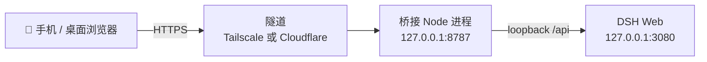

# dsh-roam

把本机 **DeepSeek Harness (DSH)** 装进口袋：一个自托管的响应式网页，让你在手机上继续操作电脑上正在运行的 DSH agent——看会话、流式聊天、回复提问/审批、切换模型、查余额。

两种接入方式，任选其一（同一套代码，只差"对外暴露"这一步）：

- **[🌐 Tailscale 版](#tailscale-免域名-推荐)** —— 免域名、私有加密隧道、零公网暴露
- **[☁️ Cloudflare 版](#cloudflare-需域名)** —— 公网 HTTPS 隧道、需要自己的域名

---

## 演示

<video src="docs/demo.mp4" controls width="100%"></video>

> 手机端操控本机 DSH Agent：会话列表 → 流式聊天 → 工具调用审批 → 完成。

---

## 架构



桥接是一个常驻 Node 进程：一边通过 DSH 的 `/api`（loopback）驱动 agent，一边对外提供网页与接口。它**不依赖 DSH 的插件槽位**，所以 DSH 升级不会影响它运行。

---

## 功能

- **会话**：列表 / 切换 / 新建 / 打断（打断按会话独立）
- **聊天**：流式回复（短回复整段升起、长回复转流式），断线自动恢复
- **交互**：提问选项按钮、审批"允许 / 拒绝"
- **上传**：文本（md / txt）+ 图片
- **账户**：余额（仅人民币）、单次会话消耗统计
- **模型**：切换模型 / 思考强度
- **界面**：深色 / 浅色 / 跟随系统；手机抽屉侧栏、桌面居中限宽
- **体验**：会话缓存秒切 + localStorage 持久化（刷新秒开）、后台预载、未读徽章、清理缓存

---

## 部署

<a id="tailscale-免域名-推荐"></a>
### Tailscale（免域名 · 推荐）

**前提**：PC 与手机都安装 [Tailscale](https://tailscale.com/download) 并登录**同一个账号**。

```bash
# Windows：右键"使用 PowerShell 运行"
scripts\start-all.ps1

# macOS / Linux
bash scripts/start-all.sh
```

脚本会幂等地拉起 `dsh web` + 桥接，并启用 `tailscale serve`（HTTPS 代理）。之后手机浏览器打开：

```
https://<机器名>.<你的tailnet>.ts.net/
```

输入 `.env` 里配置的 `WEB_PASSWORD` 即可。只有登录同一 Tailscale 账号的设备能访问，端到端加密，扫描器不可见。

<a id="cloudflare-需域名"></a>
### Cloudflare（需域名）

**前提**：有一个托管在 Cloudflare 的域名，并已配置命名隧道。

```bash
# 首次：一键配置命名隧道
powershell -File scripts\setup-tunnel.ps1 -Domain 你的域名

# Windows：右键"使用 PowerShell 运行"
scripts\start-cloudflare.ps1

# macOS / Linux
bash scripts/start-cloudflare.sh
```

脚本会拉起 `dsh web` + 桥接 + `cloudflared` 隧道。之后通过你的域名（如 `chat.你的域名`）访问。注意隧道需显式 `--protocol http2`（QUIC/7844 被墙）；部分网络下还要加 `--edge-ip-version 4` 强制走 IPv4（IPv6 到 Cloudflare 边缘可能超时）。

---

## 自动恢复（看门狗）

服务崩了 / 隧道断了，人不在电脑前也能自动拉起。`scripts/watchdog.ps1`（Windows）和 `scripts/watchdog.sh`（macOS）按 `scripts/watchdog.conf` 检查并重启指定的服务：

```ini
DSH=1                 # 守护 DSH web（3080）
BRIDGE=1              # 守护桥接（8787）
WATCH_TUNNEL=tailscale   # tailscale / cloudflare / both / none
```

- `WATCH_TUNNEL=none` → 只守护 DSH + 桥接，不碰隧道（本地访问用）
- `WATCH_TUNNEL=tailscale` 或 `cloudflare` → 额外守护对应隧道；`both` → 两条隧道都守护
- 只守护其中一项 → 把其它项改成 `0`

### 定时触发

**Windows**（任务计划程序，每 5 分钟）：

```powershell
schtasks /Create /TN "dsh-roam-watchdog" /SC MINUTE /MO 5 /F `
  /TR "powershell -NoProfile -ExecutionPolicy Bypass -File `"你的路径\dsh-roam\scripts\watchdog.ps1`""
```

**macOS**（launchd，每 5 分钟 + 登录时）：把下面 plist 存到 `~/Library/LaunchAgents/com.dsh.roam.watchdog.plist`，再 `launchctl load ~/Library/LaunchAgents/com.dsh.roam.watchdog.plist`。

```xml
<?xml version="1.0" encoding="UTF-8"?>
<!DOCTYPE plist PUBLIC "-//Apple//DTD PLIST 1.0//EN" "http://www.apple.com/DTDs/PropertyList-1.0.dtd">
<plist version="1.0"><dict>
  <key>Label</key><string>com.dsh.roam.watchdog</string>
  <key>ProgramArguments</key>
  <array><string>/bin/bash</string><string>/path/to/dsh-roam/scripts/watchdog.sh</string></array>
  <key>StartInterval</key><integer>300</integer>
  <key>RunAtLoad</key><true/>
</dict></plist>
```

---

## 托盘控制台（Windows）

想手动控制服务、不登录就自动拉起时，用系统托盘（Windows 推荐）：

```powershell
scripts\tray.ps1
```

- 鲸鱼图标（`scripts/whale.ico`）驻留系统托盘
- 右键菜单：**一键启动所有服务** / **开启·关闭监控** / **退出**
- 默认监控关闭：登录后只驻留托盘、不自动拉起服务；需要时点「一键启动」一次拉起 DSH + 桥接 + 隧道
- 开启监控后，每 5 分钟静默巡检（不弹窗口），谁挂了拉起谁
- 开机自启走注册表 `HKCU\...\Run` 的 `dsh-roam-tray` 键（无需管理员权限）

> 有了托盘后，Windows 可不再用上面的 schtasks 定时任务；macOS 仍用 launchd + `watchdog.sh`。

---

## 技术要点

- 后端纯 Node ESM、**零 npm 依赖**，`node src/index.js` 直接运行；前端是单文件 HTML，无构建步骤。
- 复用 DSH 的 loopback `/api`（一元 RPC + WebSocket 事件流 + respond），**不依赖插件槽位**，随 DSH 升级仍可用。
- SSE 心跳保活 + 断线自动恢复（轮询历史捞回）；`no-store` 防止缓存旧版本页面。
- 余额密钥只从 `~/.dsh/.credentials.yaml` 读取，只留服务端、不进仓库。

---

## 项目结构

```
dsh-roam/
├── src/
│   ├── bridge.js        # 桥接核心：会话映射、流式、提问/审批、模型
│   ├── server.js        # HTTP 服务：静态网页 + /web/api/* 接口
│   ├── config.js        # 读取 .env
│   ├── store.js         # JSON 持久化（会话映射）
│   └── dsh/client.js    # DSH /api 客户端（RPC + WebSocket 流）
├── web/index.html       # 前端单文件
├── scripts/             # 一键启动（Tailscale / Cloudflare）+ 自测
├── .env.example         # 配置示例（复制为 .env 后填写）
└── README.md
```

---

## 本地运行

```bash
# 三个进程（也可用上面的 scripts/start-all 一键脚本）
dsh web                      # DSH 本体（127.0.0.1:3080）
node src/index.js            # 桥接（127.0.0.1:8787）
tailscale serve --bg 8788    # 或 cloudflared 隧道
```

---

## English 🇬🇧

A self-hosted remote console for DeepSeek Harness (DSH): a responsive web UI for continuing your local DSH agent from your phone — sessions, streaming chat, approvals, model switching, and balance. Two ways to expose it: **Tailscale** (private tunnel, no domain) or **Cloudflare** (public HTTPS tunnel).

**Stack**: Node.js (zero npm dependencies) · WebSocket · SSE · Tailscale / cloudflared

---

## 致谢 (Acknowledgments)

Tailscale 部署方案（`tailscale serve` 集成与一键脚本）由 **Rehtd** 贡献。

---

## License

[MIT](LICENSE)
